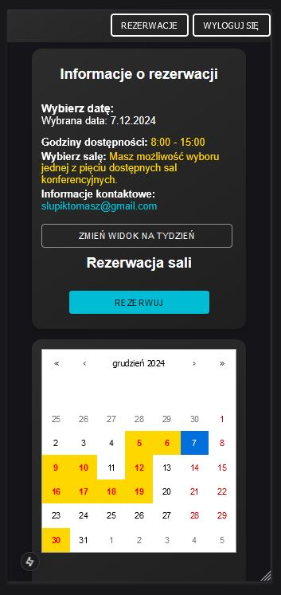

# System zarządzania rezerwacjami sal konferencyjnych

Aplikacja umożliwia zarządzanie rezerwacjami sal konferencyjnych, oferując użytkownikom pełną kontrolę nad swoimi rezerwacjami. System zapewnia funkcje przeglądania, edytowania, usuwania rezerwacji oraz eksportowania danych, a także wspiera różne urządzenia i platformy. 

## Funkcje i Opis Działania

### 1. Dostępność Aplikacji

Aplikacja jest dostępna wyłącznie dla **zalogowanych użytkowników**. Aby uzyskać dostęp do funkcji rezerwacji i zarządzania salami konferencyjnymi, użytkownik musi zalogować się do systemu.

### 2. Usunięcie Tokenu i Komunikaty Błędów

W przypadku **utraty ważności tokenu** sesji użytkownik otrzymuje odpowiedni komunikat informujący o konieczności ponownego zalogowania się. System automatycznie wygeneruje komunikat informujący o wygaśnięciu sesji i przekieruje użytkownika do strony logowania.

### 3. Responsywność

Aplikacja jest **responsywna**, co oznacza, że dostosowuje się do różnych urządzeń, w tym komputerów stacjonarnych, laptopów, tabletów oraz urządzeń mobilnych. Interfejs użytkownika zapewnia wygodne korzystanie zarówno na platformach webowych, jak i mobilnych.

### 4. Główny Panel Aplikacji

Główny panel aplikacji umożliwia **wyświetlanie wszystkich rezerwacji** – zarówno swoich, jak i innych użytkowników – w formie kalendarza. Rezerwacje można przeglądać w dwóch widokach:
- **Kalendarz tygodniowy**
- **Kalendarz miesięczny**

Widok kalendarza pozwala na łatwe śledzenie dostępności sal i planowanie spotkań.

### 5. Rezerwacja Sali

Użytkownicy mają możliwość **rezerwowania sal** bezpośrednio z poziomu aplikacji. Proces rezerwacji jest intuicyjny i szybki, a użytkownicy mogą zarezerwować dowolną dostępną salę na określony termin.

### 6. Drag and Drop podczas Rezerwacji

Aplikacja wspiera funkcję **drag and drop**, co umożliwia użytkownikom łatwe przesuwanie rezerwacji w kalendarzu. Użytkownik może przeciągnąć i upuścić rezerwację w innym terminie lub na inną salę, co znacznie ułatwia zarządzanie spotkaniami i wydarzeniami.

### 7. Przeglądanie i Edytowanie Rezerwacji

Użytkownicy mają pełną kontrolę nad swoimi rezerwacjami. Mogą:
- **Przeglądać swoje rezerwacje**.
- **Edytować je** – zmieniając daty, godziny.
- **Usuwać rezerwacje**, jeśli zajdzie taka potrzeba.
- **Wczytywać rezerwacje z pliku Excel** oraz **eksportować dane** do formatu Excel, co pozwala na łatwiejsze zarządzanie i archiwizowanie rezerwacji.

### 8. Paginacja

System wspiera **paginację**, co pozwala na efektywne przeglądanie dużych zbiorów danych. Dzięki paginacji użytkownicy mogą wygodnie nawigować między stronami rezerwacji, unikając problemów z wydajnością przy dużej liczbie zapisów.

### 9. Wyszukiwarka

Dodatkowo, aplikacja zawiera **wyszukiwarkę**, która umożliwia szybkie i łatwe **wyszukiwanie rezerwacji po nazwie sali**. Dzięki temu użytkownicy mogą błyskawicznie znaleźć interesującą ich salę, co znacznie ułatwia zarządzanie rezerwacjami, szczególnie w przypadku dużej liczby swoich rezerwacji.

### 9. Technologie

Aplikacja została zbudowana z wykorzystaniem następujących technologii:
- **Next.js** – wykorzystano framework zapewniający szybkie renderowanie po stronie serwera (SSR).
- **PostgreSQL** – relacyjna baza danych, wykorzystywana do przechowywania informacji o rezerwacjach, użytkownikach i salach konferencyjnych.
- **Flask** – użyto framework, do tworzenia backendu aplikacji, obsługujący logikę biznesową, autentykację oraz interakcję z bazą danych.

## Wykorzystane technologie i narzędzia

[](https://skillicons.dev)


## Opis folderów:

### Backend

Backend aplikacji został napisany w **Flask**. Struktura aplikacji jest następująca:

- **`/config`**: Folder zawiera plik konfiguracyjny, który umożliwia połączenie z bazą danych, zmienne środowiskowe, hasła oraz localhost.
- **`/database`**: Zawiera logikę połączenia z bazą danych do PostgreSQL.
- **`/models`**: W tym folderze znajdują się modele odpowiadające tabelom w bazie danych oraz logika związana z operacjami CRUD (tworzenie, odczyt, aktualizacja, usuwanie) dla tych danych.
- **`app.py`**: Główny plik aplikacji backendowej. Jest to punkt startowy aplikacji, który uruchamia serwer i obsługuje routing.

### Frontend

Frontend aplikacji został stworzony przy użyciu **Next.js**. Struktura folderów w aplikacji `src/app` została zaprojektowana w sposób umożliwiający łatwą nawigację oraz organizację kodu. Poniżej znajduje się szczegółowy opis poszczególnych folderów:


- **`/api`**: CRUD po stronie Frontendu.
- **`/booking`**: Routing dla poszczególnych komponentów.
- **`/components`**: Zawiera wielokrotnie wykorzystywane komponenty JSX, które stanowią podstawowe elementy interfejsu użytkownika. Folder ten obejmuje także style CSS powiązane z komponentami, np. przyciski, formularze, modale i inne elementy UI.
- **`/fonts`**: Fonty.
- **`/redux`**: Folder przechowujący logikę związaną z zarządzaniem stanem aplikacji za pomocą Redux. Zawiera pliki dotyczące akcji, reducerów i konfiguracji store'a, które umożliwiają centralne zarządzanie danymi w aplikacji.
- **`/styles`**: Główne pliki CSS oraz style aplikacji, w tym style ogólne oraz specyficzne dla komponentów, takie jak style dla przycisków, nagłówków,
- **`/theme`**: Zawiera konfigurację motywu aplikacji dla **Material-UI** (createTheme).
- **`/ui`**: Alerty, które są wykorzystywane w wielu komponentach.
- **`/utils`**: Folder przechowujący funkcje pomocnicze, które są wykorzystywane w różnych częściach aplikacji.

## Screenshots

### Mobilna wersja



## Instalacja

### Aby pobrać repozytorium:

```bash
  git clone https://github.com/TomaszSlupik/meeting_room_booking_system.git
```

### Uruchomienie Next.js:

```bash
  cd frontend
```

```bash
  npm install
```

```bash
  npm run dev
```


### Uruchomienie Flask:

```bash
  cd backend
```

```bash
  pip install -r requirements.txt
```

```bash
  python app.py
```

## Developer

- Tomasz Słupik
